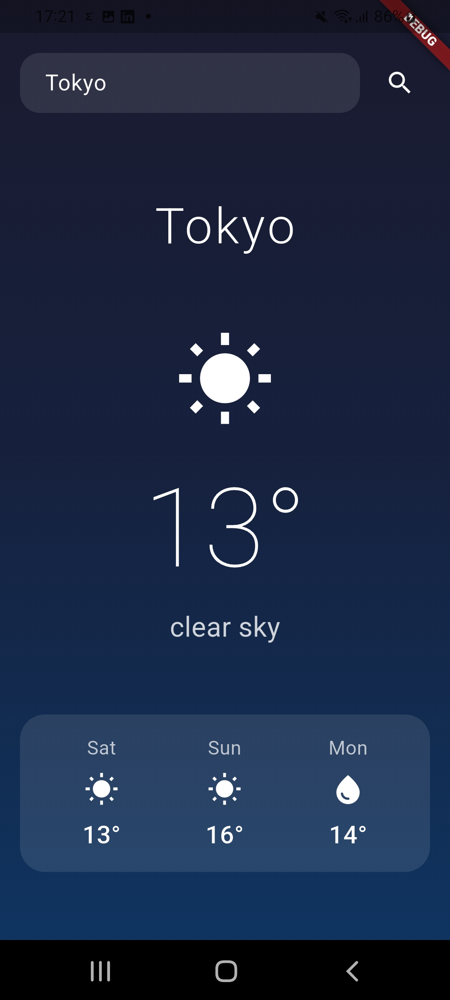

# 🌤️ Flutter Weather App

A clean, iOS-inspired weather application built with Flutter as a pet project for learning Dart and Flutter development.



## Features

- Search weather by city name
- Current temperature and weather condition
- 3-day forecast with weather icons
- Clean gradient UI inspired by iOS Weather app
- Error handling for invalid cities and network issues

## Tech Stack

- **Flutter** — UI framework
- **Dart** — programming language
- **Provider** — state management
- **json_serializable** — JSON parsing
- **http** — network requests
- **OpenWeatherMap API** — weather data

## Architecture

The app follows a layered architecture:

- `WeatherRepository` — handles API requests
- `WeatherState` — manages app state via ChangeNotifier
- `WeatherDisplayModel` — transforms API data for UI
- `json_serializable` models — type-safe JSON parsing

## Getting Started

1. Clone the repository
```bash
   git clone https://github.com/Twistercd/flutter_weather_app.git
```

2. Get dependencies
```bash
   flutter pub get
```

3. Create a `lib/local.dart` file with your API key
```dart
   const String openWeatherApiKey = 'YOUR_API_KEY';
```
   Get your free API key at [openweathermap.org](https://openweathermap.org/api)

4. Run the app
```bash
   flutter run
```

## What's Next

- [ ] Geolocation support
- [ ] Save last searched city
- [ ] Dark/light theme toggle